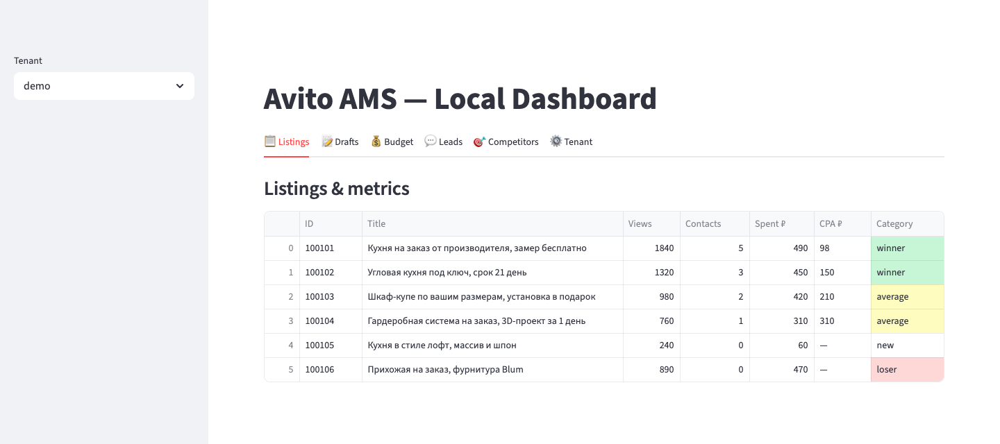
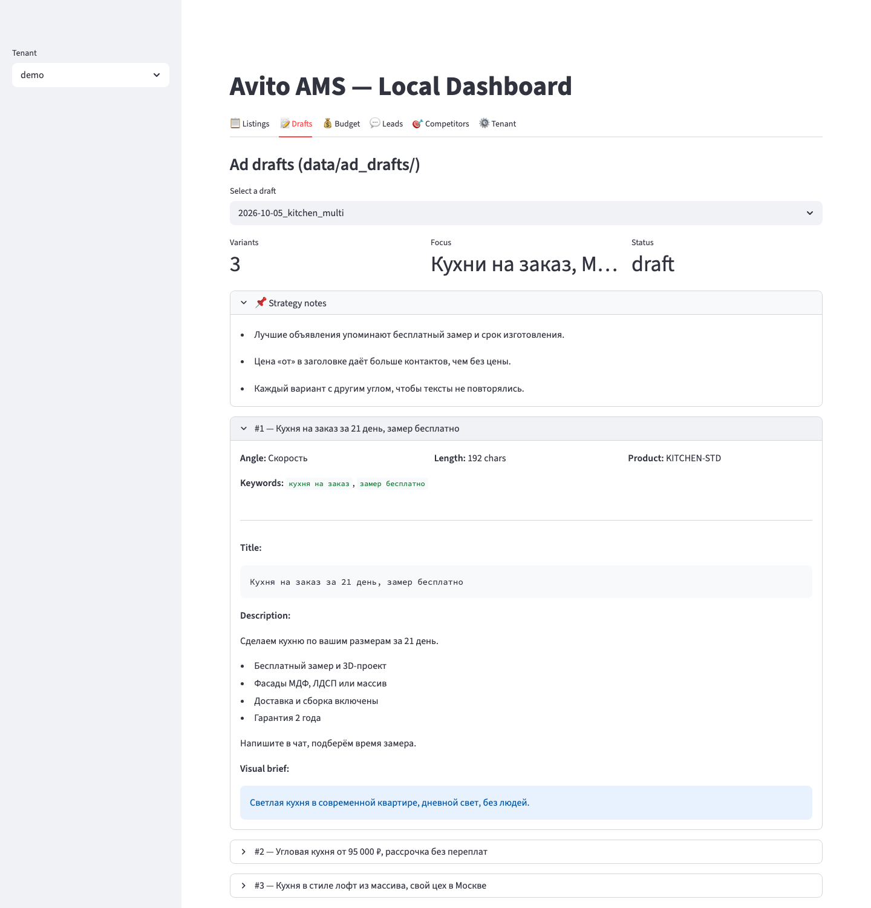
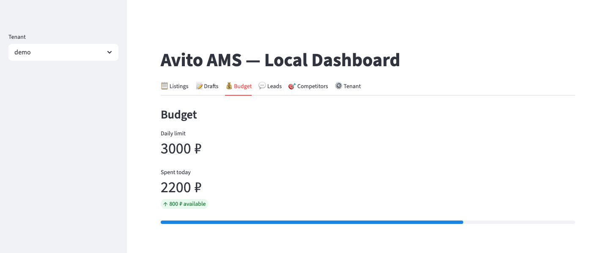
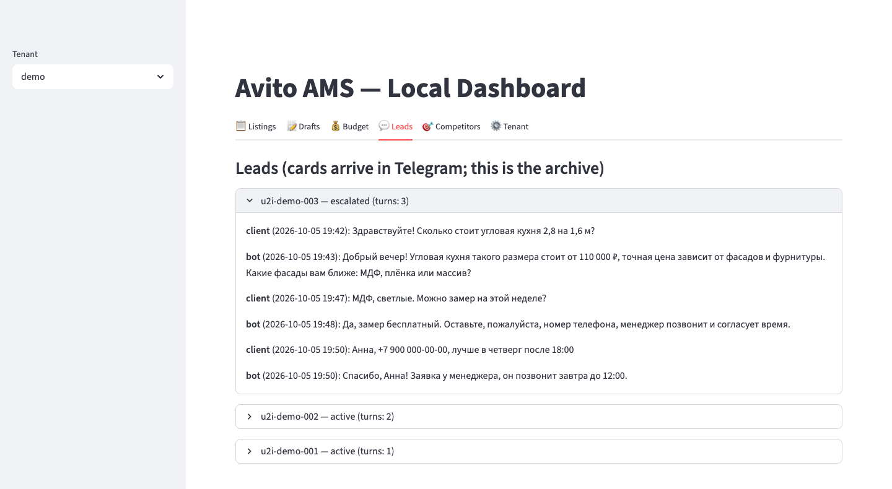
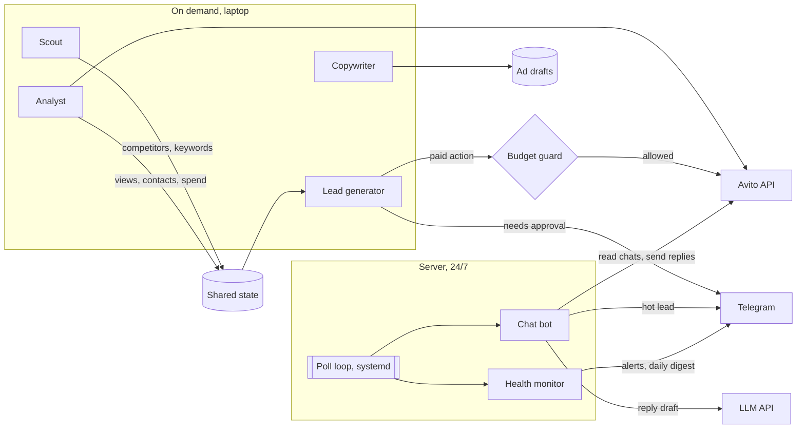

# Avito AMS

[](https://github.com/ahrimmedia-beep/avito-ams/actions/workflows/ci.yml)

Multi-agent system that runs paid advertising on Avito, the largest classifieds site in Russia. It studies competitors, drafts ads, tracks spend and cost per lead, and keeps every paid action inside budget limits. A chat bot answers clients in Avito chat around the clock. The owner gets alerts, approval requests and daily numbers in Telegram.



*The local dashboard with demo data. Each ad gets a mark: winner, average, loser or new.*

## The problem

Paid promotion on Avito needs attention every day. Without control, the daily budget can run out by noon, and weak ads keep spending money with no leads. Clients write in Avito chat at any hour and leave if nobody answers. Avito also penalizes ads that are too similar to each other. A small business owner cannot watch all of this by hand.

## What I built

- **Scout.** Collects competitor ads for a search query with Playwright: titles, prices, views, paid promotion and screenshots. It saves keywords and competitor data to the shared state.
- **Copywriter.** Drafts several ad variants on one theme, each with a title, a description and a brief for the photos. A uniqueness check rejects variants that are too close to each other.
- **Analyst.** Pulls stats from the Avito API: views, contacts, spend and current bids for each active ad. It computes cost per lead, marks each ad as a winner, average, loser or new, and writes a report.
- **Lead generator.** Reads the shared state, applies decision rules to each ad and splits the result into three groups: apply now, ask the owner in Telegram, review later.
- **Budget guard.** Checks every paid action before the API call: promo balance, daily limit per ad, daily limit in total and a stop-loss on cost per lead. Large amounts need the owner's approval.
- **Chat bot.** Runs 24/7 on a server. It reads new client messages in Avito chat, replies with an LLM and sends hot leads to the owner in Telegram. It skips system chats, old messages and chats the owner already handles, limits replies per chat and logs prompt injection attempts.
- **Balance and status.** Quick command line checks: wallet and promo balance with spend for the last 24 hours, and a health check of config, state and modules.
- **Telegram reports.** Lead cards, approval requests with buttons, alerts on API errors and low disk space, and a daily digest of the chat bot numbers.

A local Streamlit dashboard shows the state, reports and leads. Everything is set per tenant in one config file, so the same system can run for more than one business.

## Screenshots

All screenshots use demo data. The ads, prices, clients and phone numbers are made up.



*Ad drafts from the Copywriter. Each variant has its own angle, keywords, text and photo brief.*



*Budget for the day. It shows the daily limit, the spend so far and what is left.*



*Chat archive. The bot answers the client, and when the client is ready, the chat goes to a manager.*

## How it works



The agents do not call each other. They share one JSON state file per tenant. The Scout and the Analyst write to it, and the Lead generator reads it. Agents on the laptop start on demand, so nothing burns tokens or money in the background.

Every action that spends money goes through the budget guard first. The guard reserves the amount in a file-locked ledger and releases it after the API call. Two runs at the same time cannot both pass the same limit.

The chat bot is the only process that runs all the time. It is a systemd service that polls Avito chats in a loop and runs the health checks after each cycle.

## Selected code

This repository holds a few real modules from the product, with their tests, to show how the code is written. The LLM prompts, ad texts, decision rules, the Avito API client, tenant configs and the deployment setup stay private. The full project has about 200 tests.

| File | What it shows |
|---|---|
| [`avito_ams/budget_guard.py`](avito_ams/budget_guard.py) | Pre-flight check for every paid action: balance, daily limits per ad and in total, stop-loss on cost per lead. A file-locked reservation ledger with a timeout closes the gap between the check and the API call. |
| [`avito_ams/pacing.py`](avito_ams/pacing.py) | Spreads the daily budget over 24 hours with a larger share for peak hours. Recommends a bid change when real spend drifts too far from the target. |
| [`avito_ams/state_store.py`](avito_ams/state_store.py) | Shared JSON state for the agents: atomic writes through a temp file, an exclusive file lock for updates, and a tenant id check that blocks path traversal. |
| [`avito_ams/health_monitor.py`](avito_ams/health_monitor.py) | Async health checks inside the chat bot: API errors in a row, errors per hour, disk space and a daily digest to Telegram. Counters are saved to disk and reset every day. |
| [`avito_ams/budget_limits.py`](avito_ams/budget_limits.py), [`avito_ams/tenant_id.py`](avito_ams/tenant_id.py) | Small helpers: the Pydantic model for budget limits and the tenant id check. |

```bash
python -m venv .venv && source .venv/bin/activate
pip install -e ".[dev]"
pytest             # 43 tests, Python 3.11+, Linux or macOS
ruff check .
```

## Stack

Python 3.11+, asyncio, httpx, Pydantic, PyYAML, Avito API (OAuth2), DeepSeek API for chat replies, python-telegram-bot, Claude Code with Playwright for the on-demand agents, Streamlit, pytest, systemd on a Linux server.

## My role

I built the system alone: architecture, agents, Avito and Telegram integrations, tests and deployment to the server.

## License

Published for viewing only. All rights reserved, see [LICENSE](LICENSE).
